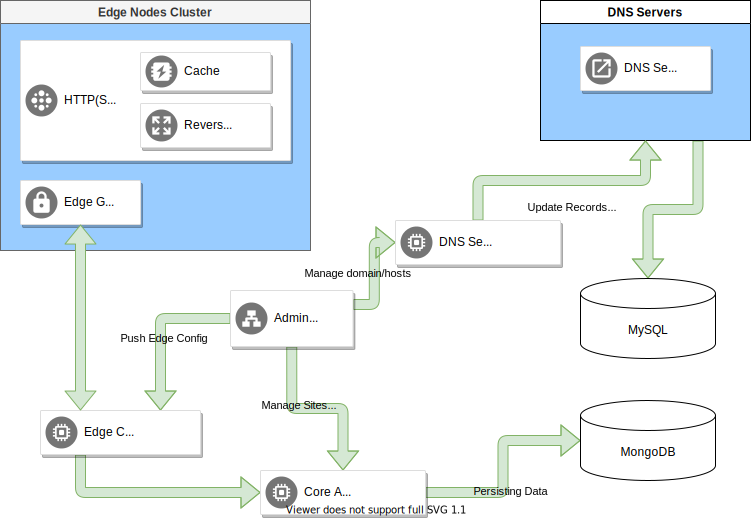

# Self Hosted CDN

## 1. Services

- Edge Server
 
        Serving the end-user traffic by cached static assets, and reverse proxy to backends
        Powered by Caddy

 

- Edge Guard
 
        Run on Edge Server instance
        Supply configuration when Edge Server starts
        Accept JSON config push request, cache locally, and update the config to Edge Server
        Report `Edge Server` status change

 

- DNS Server
    
        Clustered, high availability DNS server
        Powered by PowerDNS
        Mysql Database back-end

 

- DNS Admin API

        Provide DNS records management service
        by by updating MYSQL of DNS Server

 

- Edge Communicator

        Act as a bridge between Edge Guard and Core API

 

- Core API
    
        Provide `Sites` and `Edge` Management service
        Push `Edge` Configs to Edge Communicator upon configs change

     

- Admin BFF
    
        Provide Admin API for Admin FrontEnd
        By consuming Core API, Edge Communicator, and DNS Admin API

## 2. Definition of `Site`
    
    site = {
        "name": "",
        "domain": "",
        "ssl": {
            "enabled": false,
        },
        "backends": [
            {
                "name": "",
                "type": "",
                "host": "",
                "port": "",
                "weight": "",
                "enabled": false
            }
        ]
    }

## 3. Definition of `Edge`

    edge = {
        "name": "",
        "ip": "",
    }